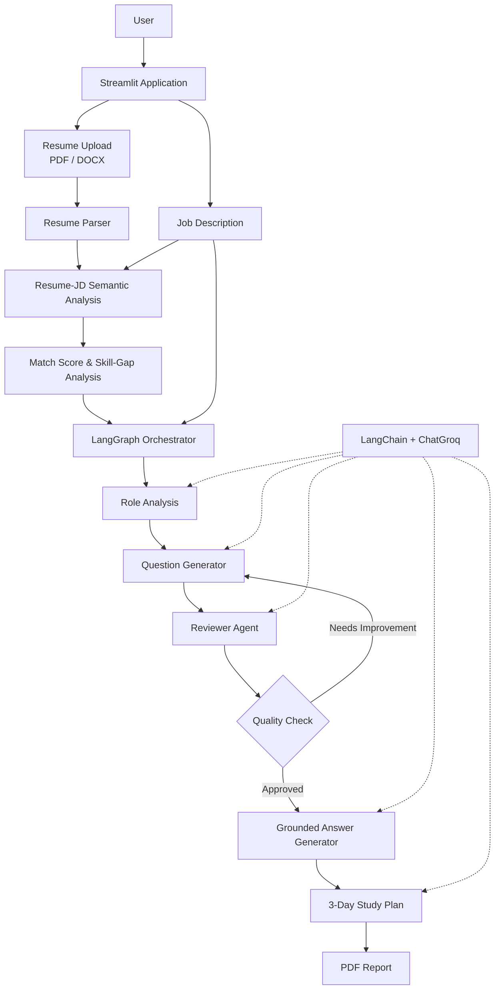

# 🎯 Interview Prep Agent

> **Agentic AI Interview Preparation System built with LangChain, LangGraph, Groq LLM, Python, and Streamlit.**

An AI-powered application that analyzes a **Job Description and an optional resume** to identify skill gaps, generate role-specific interview questions, review question quality, create grounded answer frameworks, and build a focused 3-day interview preparation plan.

🔗 **Live Demo:** https://interview-prep-agent-94gjmmzu9q3w9gp4by8uan.streamlit.app/

---

## ✨ Core Features

- Extracts technical and soft-skill requirements from a Job Description
- Generates **5 technical + 3 behavioral** interview questions
- Uses an **AI Reviewer** to evaluate question quality
- Supports **conditional question regeneration** when review validation fails
- Generates grounded interview answers
- Uses **STAR-style frameworks** when candidate experience is not sufficiently supported
- Supports **PDF and DOCX resume uploads**
- Performs **Resume–JD semantic matching**
- Identifies matching skills and missing skills
- Generates skill-gap preparation priorities
- Creates a personalized **3-day interview preparation plan**
- Exports the complete preparation as a downloadable PDF report

---

## 🧠 LangChain + LangGraph Implementation

The project uses **LangChain and LangGraph at a foundational level** to implement a structured agentic interview-preparation workflow.

### LangChain

**LangChain** is used as the LLM interaction layer and is implemented primarily in `src/agent.py`.

It is used for:

- `ChatPromptTemplate` for structured prompts
- `ChatGroq` integration
- LLM invocation
- Passing structured instructions to the model
- Role analysis
- Interview question generation
- Question review
- Answer generation
- Study-plan generation

### LangGraph

**LangGraph** is used for workflow orchestration and is implemented in `src/graph.py`.

It is used for:

- Shared workflow state
- Workflow nodes
- Connecting processing stages with edges
- Controlling execution order
- Conditional routing
- Reviewer feedback loop
- Question regeneration when validation fails

The implementation focuses on the **core concepts of LangChain and LangGraph** rather than advanced autonomous multi-agent functionality.

---

## 🏗️ System Architecture



---

## 🤖 Agentic Workflow

The application uses a multi-stage workflow rather than sending the entire task through a single prompt.

```text
Resume + Job Description
          ↓
Resume-JD Analysis
          ↓
Skill-Gap Analysis
          ↓
LangGraph Workflow
          ↓
Role Analysis
          ↓
Question Generation
          ↓
Question Review
          ↓
     Quality Check
       ↙       ↘
 Regenerate   Continue
     ↑           ↓
     └────  Grounded Answers
                 ↓
          3-Day Study Plan
                 ↓
             PDF Report
```

The reviewer introduces a feedback loop. If the generated question set fails validation, **LangGraph can route execution back to the question-generation stage** before the workflow continues.

---

## 📊 Resume–JD Analysis

When a resume is uploaded, the application compares it with the Job Description using semantic similarity.

```text
Resume + Job Description
          ↓
Sentence Transformer
          ↓
Embeddings
          ↓
Cosine Similarity
          ↓
Semantic Match Score
```

The analysis provides:

- Semantic match score
- Matching skills
- Missing skills
- Skill-gap analysis
- Preparation priorities

> **Note:** The match score represents semantic similarity. It is not an ATS score, recruiter decision, or hiring probability.

---

## 🛡️ Grounded Answer Generation

The answer-generation stage includes safeguards to reduce unsupported candidate claims.

For experience-based questions:

- Candidate-specific claims should be supported by available context
- Unsupported achievements and metrics are avoided
- The system avoids intentionally inventing employers, projects, results, or experiences
- When sufficient candidate evidence is unavailable, a **STAR-style framework with placeholders** can be generated

For hypothetical technical questions, the system uses language such as **"I would..."** rather than falsely claiming that the candidate has already performed the task.

---

## 🛠️ Tech Stack

| Area | Technology |
|---|---|
| Language | Python |
| Frontend | Streamlit |
| LLM Framework | **LangChain** |
| Agent Orchestration | **LangGraph** |
| LLM Integration | **ChatGroq** |
| LLM Provider | Groq |
| Embeddings | Sentence Transformers |
| Similarity | Cosine Similarity / Scikit-learn |
| PDF Parsing | pdfplumber |
| DOCX Parsing | python-docx |
| PDF Report Generation | FPDF2 |
| Testing | pytest |
| Deployment | Streamlit Community Cloud |
| Version Control | Git & GitHub |

---

## 📁 Project Structure

```text
interview-prep-agent/
│
├── app.py
├── requirements.txt
├── README.md
├── .gitignore
│
├── src/
│   ├── agent.py
│   ├── graph.py
│   ├── prompts.py
│   ├── parser.py
│   ├── models.py
│   ├── utils.py
│   ├── config.py
│   └── logger.py
│
└── tests/
    └── test_agent.py
```

### Main Files

- `app.py` — Streamlit UI, Resume–JD analysis, workflow execution, report display, and PDF generation
- `src/agent.py` — **LangChain + ChatGroq** LLM integration, generation logic, grounding, and validation
- `src/graph.py` — **LangGraph** workflow, shared state, nodes, edges, and conditional routing
- `src/prompts.py` — prompts for individual AI stages
- `src/parser.py` — PDF and DOCX resume text extraction
- `src/models.py` — structured application data models
- `src/utils.py` — Resume–JD semantic similarity utilities
- `src/config.py` — application configuration
- `src/logger.py` — application logging
- `tests/test_agent.py` — automated tests for core agent behavior

---

## 🚀 Run Locally

### 1. Clone the Repository

```bash
git clone https://github.com/pallavivhalgade/interview-prep-agent.git
cd interview-prep-agent
```

### 2. Install Dependencies

```bash
pip install -r requirements.txt
```

### 3. Configure the Groq API Key

Create a `.env` file in the project root:

```env
GROQ_API_KEY=your_groq_api_key
```

> Never commit the `.env` file or API keys to GitHub.

### 4. Start the Application

```bash
streamlit run app.py
```

---

## 🧪 Testing

The project uses **pytest** for automated testing.

LLM calls are mocked during unit tests so core pipeline behavior can be tested without depending on live API responses.

Run:

```bash
python -m pytest tests -v
```

---

## ⚠️ Current Limitations

- LLM-generated content can vary between runs
- Resume–JD matching measures semantic similarity rather than actual ATS or recruiter decisions
- LangChain and LangGraph are implemented at a **foundational level**, not as an advanced autonomous multi-agent architecture
- Generated interview guidance should be reviewed by the candidate before use

---

## 🔐 Security

Sensitive and generated development files are excluded from Git using `.gitignore`.

Examples:

```text
.env
*.log
__pycache__/
*.pyc
```

API keys should never be committed to the repository.

---

## 👩‍💻 Author

**Pallavi Vholgade**  
B.E. — Artificial Intelligence & Machine Learning

GitHub: https://github.com/pallavivhalgade