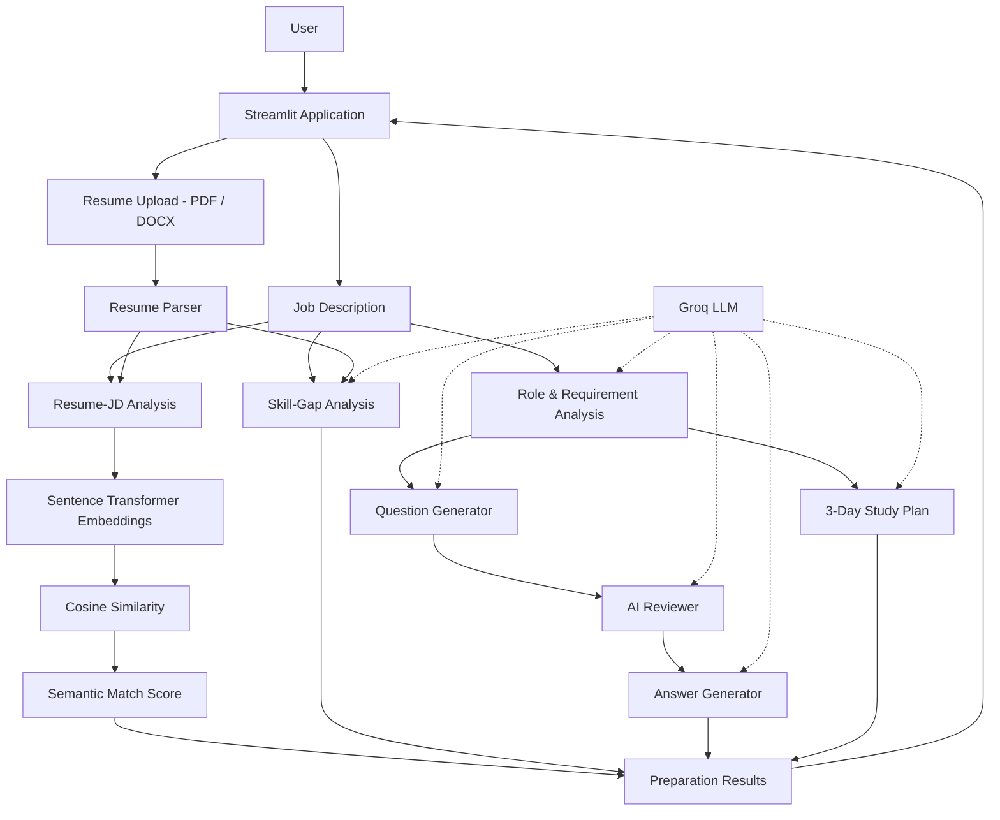

# 🎯 Interview Prep Agent

An **AI-powered interview preparation application** built with **Python, Groq LLM, Streamlit, and Sentence Transformers**.

The application analyzes a **Job Description and an optional resume** to identify skill gaps, generate role-specific interview questions, review question quality, create grounded answer frameworks, and build a focused 3-day interview preparation plan.

🔗 **Live Demo:** https://interview-prep-agent-94gjmmzu9q3w9gp4by8uan.streamlit.app/
---

## ✨ Core Features

- Extracts technical and soft-skill requirements from a Job Description
- Generates targeted technical and behavioral interview questions
- Uses an AI review stage to improve question relevance and quality
- Generates concise interview answer frameworks
- Supports STAR-style behavioral answer preparation
- Supports PDF and DOCX resume uploads
- Performs Resume–JD semantic matching
- Identifies matching and missing skills
- Performs skill-gap analysis
- Generates preparation priorities
- Creates a personalized 3-day interview preparation plan
- Exports preparation results as a downloadable PDF report

---

## 🏗️ System Architecture



---

## 🤖 AI Workflow

The application uses a structured multi-stage Python workflow rather than sending the entire interview-preparation task through one large prompt.

```text
Job Description
      ↓
Role & Requirement Analysis
      ↓
Question Generation
      ↓
AI Review
      ↓
Answer Generation
      ↓
3-Day Study Plan
```

Each stage performs a specific responsibility and passes its result to the next stage.

The application uses the **Groq API directly** for LLM inference.

---

## 📊 Resume–JD Analysis

When a resume is uploaded, the application compares it with the Job Description using semantic similarity.

```text
Resume + Job Description
          ↓
Sentence Transformer
          ↓
Text Embeddings
          ↓
Cosine Similarity
          ↓
Semantic Match Score
```

The application also identifies:

- Matching skills
- Missing skills
- Skill gaps
- Preparation priorities

> **Note:** The match score represents semantic similarity. It is not an ATS score, recruiter decision, or hiring probability.

---

## 🛡️ Grounded Answer Generation

The answer-generation stage uses available candidate context to reduce unsupported personal claims.

For experience-based questions:

- Candidate-specific claims should be supported by available resume context
- Unsupported achievements and metrics are avoided
- The system avoids intentionally inventing employers, projects, or experience
- STAR-style answer frameworks can be used when sufficient candidate evidence is unavailable

For hypothetical technical questions, answers can be framed as approaches rather than claiming experience the candidate has not provided.

---

## 🛠️ Tech Stack

| Area | Technology |
|---|---|
| Language | Python |
| Frontend | Streamlit |
| Generative AI | Groq LLM |
| LLM Integration | Groq API |
| NLP / Embeddings | Sentence Transformers |
| Similarity | Cosine Similarity / Scikit-learn |
| Machine Learning | Scikit-learn |
| Data Processing | Pandas, NumPy |
| PDF Parsing | pdfplumber |
| DOCX Parsing | python-docx |
| PDF Generation | FPDF2 |
| Testing | pytest |
| Deployment | Streamlit Community Cloud |
| Version Control | Git & GitHub |
---

## 📁 Project Structure

```text
interview-prep-agent/
│
├── app.py
├── requirements.txt
├── README.md
├── .gitignore
│
├── src/
│   ├── agent.py
│   ├── prompts.py
│   ├── parser.py
│   ├── models.py
│   ├── utils.py
│   ├── config.py
│   └── logger.py
│
└── tests/
    └── test_agent.py
```

### Main Files

- `app.py` — Streamlit user interface, analysis workflow, results, and report generation
- `src/agent.py` — Groq LLM integration and AI pipeline logic
- `src/prompts.py` — prompts used by the AI stages
- `src/parser.py` — PDF and DOCX resume text extraction
- `src/models.py` — structured application data models
- `src/utils.py` — Resume–JD semantic similarity utilities
- `src/config.py` — application configuration
- `src/logger.py` — application logging
- `tests/test_agent.py` — automated tests for core pipeline behavior

---

## 🚀 Run Locally

### 1. Clone the Repository

```bash
git clone https://github.com/pallavivhalgade/interview-prep-agent.git
cd interview-prep-agent
```

### 2. Install Dependencies

```bash
pip install -r requirements.txt
```

### 3. Configure the Groq API Key

Create a `.env` file in the project root:

```env
GROQ_API_KEY=your_groq_api_key
```

> Never commit your `.env` file or API key to GitHub.

### 4. Start the Application

```bash
streamlit run app.py
```

---

## 🧪 Testing

The project uses **pytest** for automated testing.

LLM calls are mocked during unit tests so core pipeline behavior can be tested without depending on live Groq API responses.

Run:

```bash
python -m pytest tests -v
```

---

## ⚠️ Current Limitations

- LLM-generated content can vary between runs
- Resume–JD matching measures semantic similarity rather than actual ATS or recruiter decisions
- Generated interview guidance should be reviewed by the candidate before use

---

## 🔐 Security

Sensitive files and generated development files are excluded using `.gitignore`.

Examples:

```text
.env
*.log
__pycache__/
*.pyc
```

API keys should never be committed to the repository.

---

## 👩‍💻 Author

**Pallavi Vholgade**  
B.E. — Artificial Intelligence & Machine Learning

GitHub: https://github.com/pallavivhalgade
