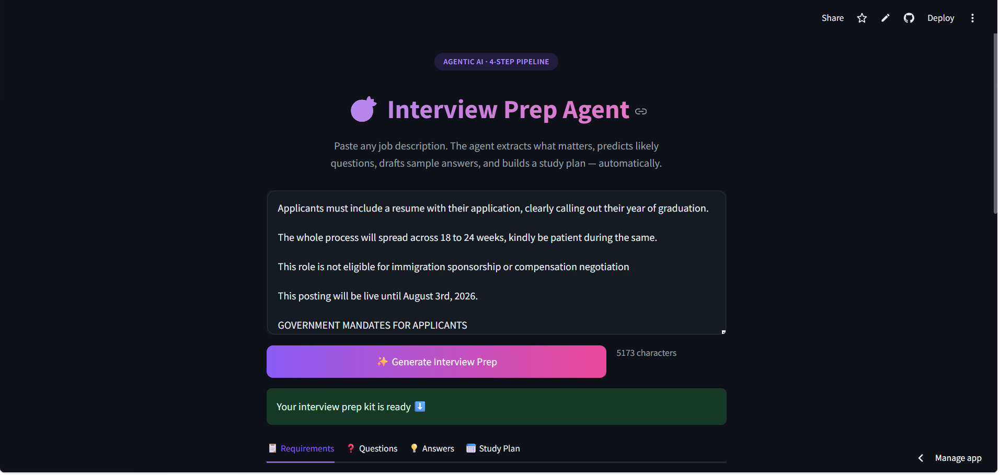
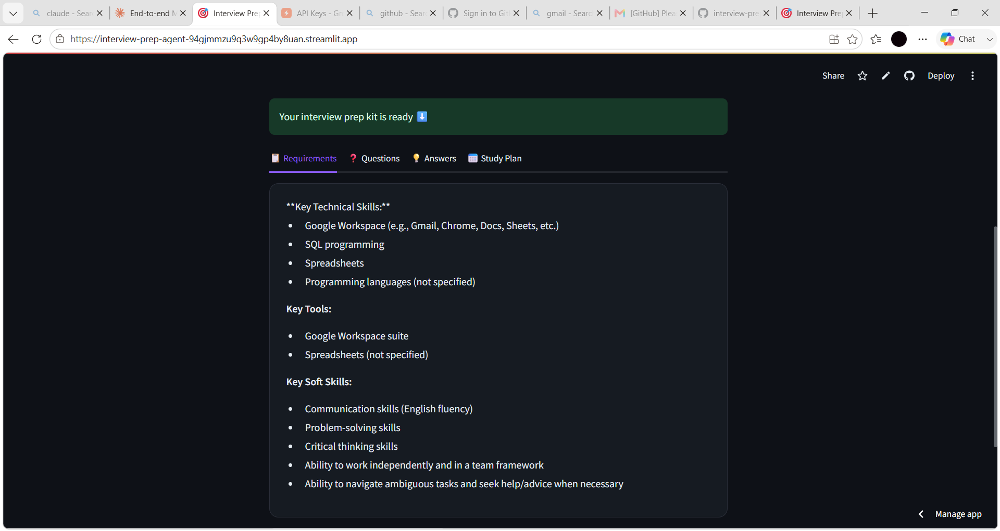

# 🎯 Interview Prep Agent

An agentic AI tool that turns a job description — and optionally your resume —
into a complete interview prep kit: extracted requirements, reviewed
interview questions, sample answers, a study plan, a resume-JD match score,
and a skill gap analysis.

🔗 **Live demo:** [interview-prep-agent-94gjmmzu9q3w9gp4by8uan.streamlit.app](https://interview-prep-agent-94gjmmzu9q3w9gp4by8uan.streamlit.app/)





## Problem
Preparing for an interview usually means manually re-reading a job
description, guessing what might be asked, checking how well your resume
actually fits, and researching answers one by one. This agent automates
that entire workflow — including a self-review step that most simple
LLM wrappers skip.

## Approach
A **5-step agent pipeline**, where each step's output feeds into the next,
plus a Reviewer Agent that critiques and sharpens another agent's output
before it's used downstream:

```
Job Description
      │
      ▼
1. Extract Requirements ──▶ 2. Generate Questions ──▶ 3. Reviewer Agent
                                                              │
                                                              ▼
                          5. Study Plan  ◀──────────── 4. Generate Answers
```

If a resume is uploaded (PDF or DOCX), it also runs:
- **Resume ↔ JD Match Score** — cosine similarity between local sentence
  embeddings of the resume and job description (no external API call)
- **Skill Gap Analysis** — matching skills, missing skills, and one
  concrete suggestion, generated via a structured JSON prompt

## Results
Given a job description (and optionally a resume), the agent produces:
- A bulleted list of extracted requirements
- 8 interview questions, reviewed and sharpened by a second "reviewer" LLM pass
- Sample answers / STAR-method frameworks for each question
- A focused 3-day study plan
- A resume-JD match percentage
- A skill gap breakdown with an actionable next step

## Engineering decisions worth calling out
- **Reviewer Agent pattern**: instead of trusting the first LLM output,
  a second agent step critiques and rewrites weak/vague questions —
  genuinely agentic behavior, not just a single prompt call.
- **Local embeddings for matching**: the match score uses
  `sentence-transformers` running locally rather than calling an external
  API — free, fast, and avoids sending resume data to a third party
  unnecessarily.
- **Structured JSON output**: the skill gap step asks the LLM to return
  JSON and parses it directly, with a safe fallback if the LLM doesn't
  comply — avoids brittle text-splitting logic.
- **Separation of concerns**: prompts, config, logging, models, parsing,
  and pipeline logic each live in their own module (see structure below)
  rather than one large script.
- **Logging + error handling**: every LLM call and file parse is logged;
  failures surface a friendly message in the UI instead of a raw traceback.

## Limitations & what I'd improve next
- No memory across sessions — could store past job descriptions and
  track prep across multiple applications
- Answer quality depends on the JD's specificity — vague JDs produce
  more generic questions
- Skill gap parsing assumes the LLM returns valid JSON most of the time;
  a stricter structured-output mode (e.g., function calling) would make
  this more reliable
- No retry/backoff on transient API failures yet — a good next addition,
  but only worth doing with a real understanding of when retries are
  appropriate (not blindly retrying every error type)

## Project Structure
```
interview-prep-agent/
├── app.py                  # Streamlit UI
├── src/
│   ├── __init__.py
│   ├── config.py            # centralized settings (model name, constants)
│   ├── logger.py            # centralized logging setup
│   ├── prompts.py           # all LLM prompts, separate from logic
│   ├── models.py            # typed dataclasses for pipeline results
│   ├── agent.py             # 5-step pipeline + skill gap analysis
│   ├── parser.py            # PDF/DOCX resume text extraction
│   └── utils.py             # embedding-based resume-JD match scoring
├── tests/
│   ├── __init__.py
│   └── test_agent.py        # mocked-LLM tests for pipeline & parsing logic
├── screenshots/
│   ├── demo-hero.png
│   └── demo-results.png
├── .streamlit/
│   └── config.toml          # custom purple theme
├── requirements.txt
├── runtime.txt               # pinned Python version for deployment
├── .env.example
├── .gitignore
└── README.md
```

## How to run locally

```bash
git clone https://github.com/pallavivhalgade/interview-prep-agent.git
cd interview-prep-agent
pip install -r requirements.txt
cp .env.example .env   # then add your free Groq API key to .env
streamlit run app.py
```

Get a free Groq API key at: https://console.groq.com

Note: first run downloads a small (~90MB) local embedding model used for
resume-JD matching — one-time only.

## Running tests

```bash
pytest tests/ -v
```

Tests mock the LLM calls, so they run instantly with no API key or cost —
they check pipeline ordering and JSON-parsing/fallback logic, not the
LLM's output quality itself.

## Tech Stack
- **Language:** Python
- **LLM / AI:** Groq API (Llama 3.1 8B) — agentic 5-step pipeline with a Reviewer Agent
- **Embeddings:** `sentence-transformers` (local, free) for resume-JD match scoring
- **File parsing:** `pdfplumber` (PDF), `python-docx` (DOCX)
- **Frontend:** Streamlit, custom CSS (gradient theming, card layouts)
- **Testing:** `pytest` with mocked LLM calls
- **Logging:** Python's built-in `logging` module, console + file output
- **Version control:** Git & GitHub (incremental commit history)
- **Deployment:** Streamlit Community Cloud, with `runtime.txt` (pinned Python version) and Streamlit Secrets for API key management

## Author
**Pallavi Vholgade**
🔗 [LinkedIn](https://linkedin.com/in/YOUR-LINKEDIN-HANDLE)
📧 your.email@gmail.com
