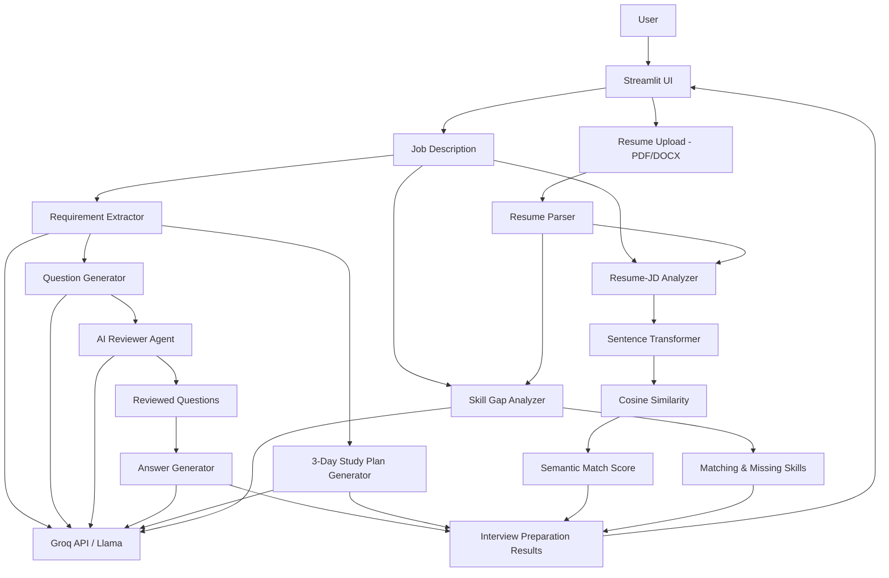

# 🎯 Interview Prep Agent

An **Agentic AI-powered interview preparation application** that analyzes a Job Description and an optional resume to generate role-specific interview questions, review them for quality, identify skill gaps, and create a focused preparation plan.

🔗 **Live Demo:** [Open Interview Prep Agent](https://interview-prep-agent-94gjmmzu9q3w9gp4by8uan.streamlit.app/)

---

## ✨ Core Features

- Extracts key technical and soft-skill requirements from a Job Description
- Generates **5 technical + 3 behavioral** interview questions
- Uses an **AI Reviewer Agent** to refine questions for relevance, clarity, and redundancy
- Generates concise answer frameworks, including **STAR-based behavioral answers**
- Supports **PDF and DOCX resume uploads**
- Performs **Resume–JD semantic matching** using Sentence Transformers and cosine similarity
- Identifies matching skills, missing skills, and preparation priorities
- Generates a focused **3-day interview preparation plan**
- Exports the generated preparation as a downloadable report

---

## 🏗️ System Architecture



---

## 🤖 Agentic AI Workflow

The application uses a structured multi-stage LLM workflow instead of a single prompt-response interaction.

```text
Job Description
      ↓
Requirement Extractor
      ↓
Question Generator
      ↓
AI Reviewer Agent
      ↓
Reviewed Questions
      ↓
Answer Generator

Requirements
      ↓
3-Day Study Plan
```

Each stage has a specialized responsibility, and intermediate outputs are passed to downstream stages.

> The current implementation is a structured **agentic workflow orchestrated in Python**, not a fully autonomous multi-agent system.

---

## 📊 Resume–JD Analysis

When a resume is uploaded:

```text
Resume + Job Description
          ↓
   Sentence Transformer
          ↓
       Embeddings
          ↓
    Cosine Similarity
          ↓
 Semantic Match Score
```

The application also identifies:

- Matching skills
- Missing skills
- Preparation suggestions

> The match score represents **semantic similarity** and should not be interpreted as an ATS score or selection probability.

---

## 🛠️ Tech Stack

| Area | Technology |
|---|---|
| Language | Python |
| Frontend | Streamlit |
| LLM Inference | Groq API |
| LLM | Llama |
| Embeddings | Sentence Transformers |
| Similarity | Cosine Similarity |
| PDF Parsing | pdfplumber |
| DOCX Parsing | python-docx |
| Testing | pytest |
| Version Control | Git & GitHub |
| Deployment | Streamlit Community Cloud |

---

## 📁 Project Structure

```text
interview-prep-agent/
│
├── app.py
├── requirements.txt
├── README.md
│
├── src/
│   ├── agent.py
│   ├── prompts.py
│   ├── parser.py
│   ├── models.py
│   ├── utils.py
│   ├── config.py
│   └── logger.py
│
└── tests/
    └── test_agent.py
```

---

## 🚀 Run Locally

### 1. Clone the repository

```bash
git clone https://github.com/pallavivhalgade/interview-prep-agent.git
cd interview-prep-agent
```

### 2. Install dependencies

```bash
pip install -r requirements.txt
```

### 3. Configure the Groq API key

Create a `.env` file:

```env
GROQ_API_KEY=your_api_key_here
```

> **Never commit your `.env` file or API keys to GitHub.**

### 4. Start the application

```bash
streamlit run app.py
```

---

## 🧪 Testing

The project uses **pytest** for automated testing.

LLM calls are mocked during unit tests so the pipeline can be tested without depending on live API responses.

```bash
pytest
```

---

## ⚠️ Current Limitations

- LLM-generated content can vary between runs.
- The Reviewer Agent currently refines questions but does not use threshold-based conditional regeneration.
- Resume–JD matching measures semantic similarity rather than actual recruiter or ATS decisions.

---

## 👩‍💻 Author

**Pallavi Vholgade**  
B.E. — Artificial Intelligence & Machine Learning

[GitHub Profile](https://github.com/pallavivhalgade)

---

⭐ If you find this project useful, consider starring the repository.
